title: Build Your Own House & Atelier Bow-Wow
date: 2014/10/17
---

    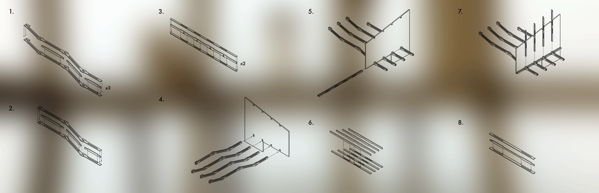

    

    

        <h1 class="bold">{{ title }}</h1>
        

        
Atelier Bow-Wow's 2005 <a href="http://bow-wow.jp/profile/2005/HouseAtelierBowWow/index.html" target="_blank">House &amp; Atelier</a> is located in the Shinjuku neighborhood of Tokyo, but now you can build (a facsimile of) it in the comfort of your home.

        

            

                
Download the parts here and send them to your favorite laser cutter.
                <small>Materials required: 3/32" thick chipboard (not provided).</small>

            

            

                <ul class="no-underline caps">
                    <li><a download href="images/pieces.ai">Download .ai</a></li>
                    <li><a download href="images/pieces.eps">Download .eps</a></li>
                    <li><a download href="images/pieces.svg">Download .svg</a></li>
                </ul>
            

        

        
Once you have your building materials, download the <a download href="images/instructions.pdf">assembly instructions</a>.

    

    

    

        

            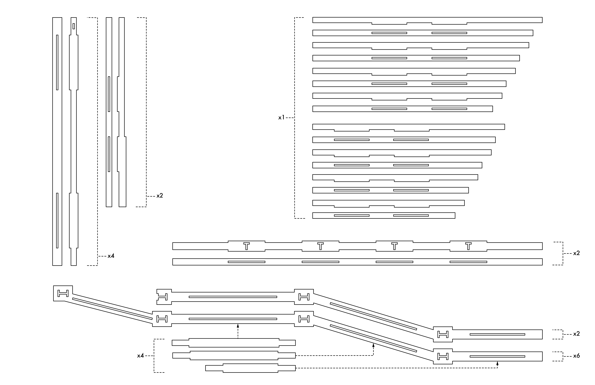
        

        

            

                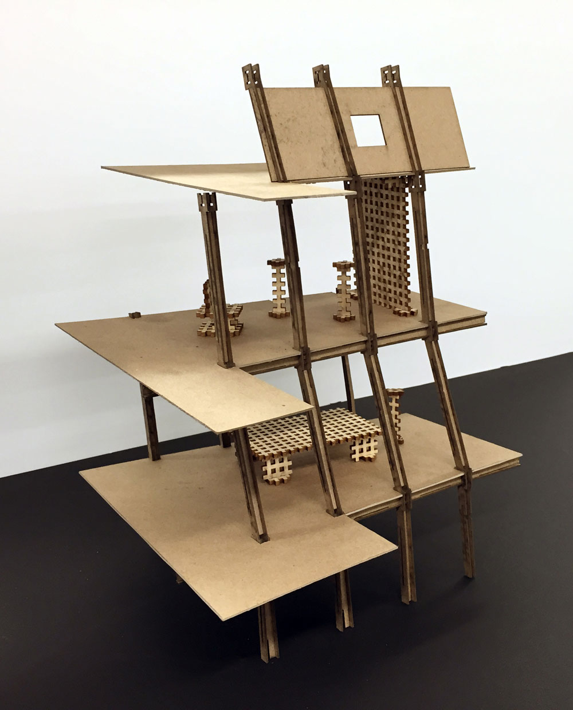
            

            

                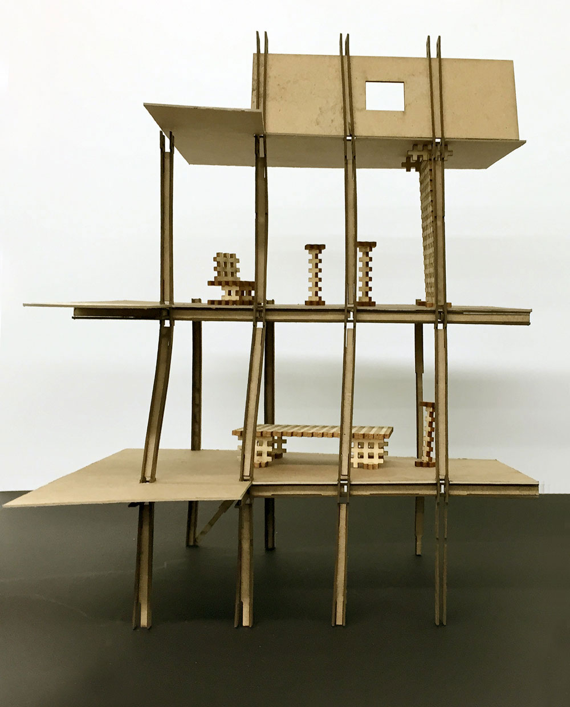
            

        

    

    

    
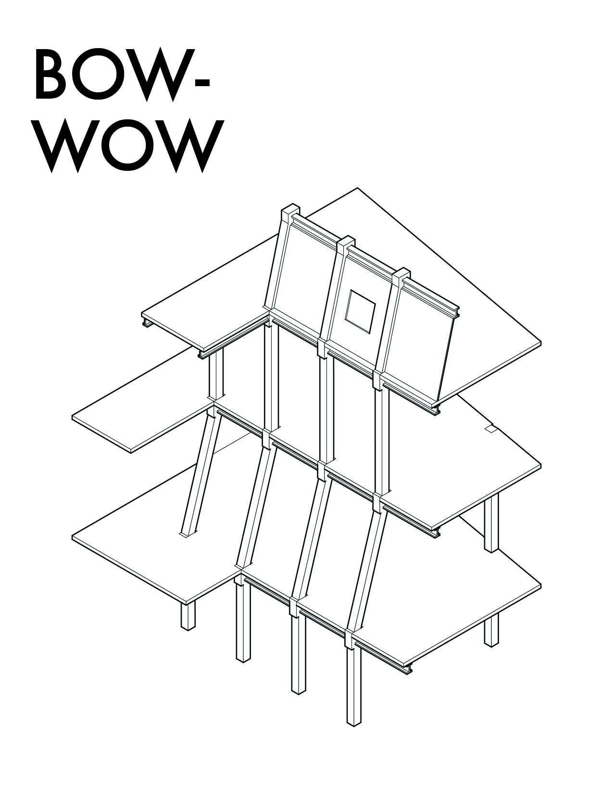

    
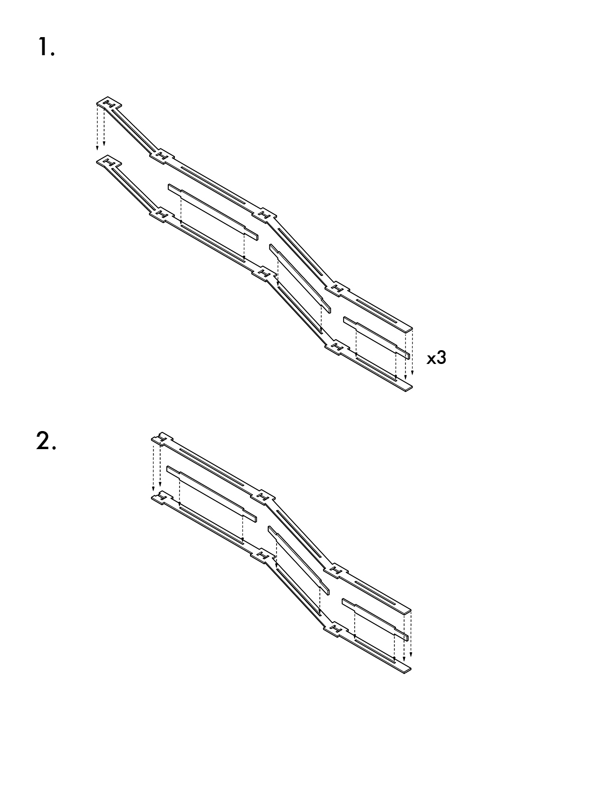

    

    
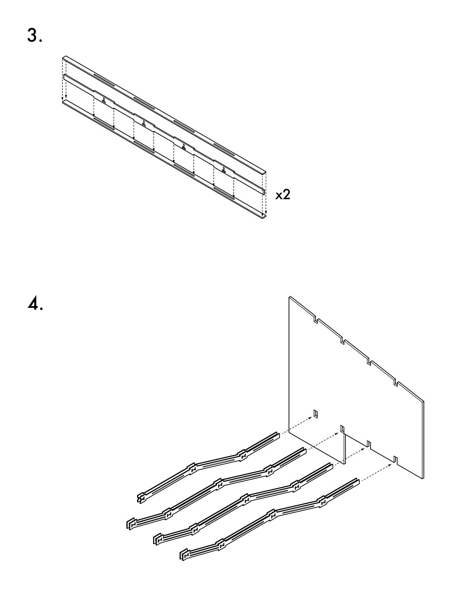

    
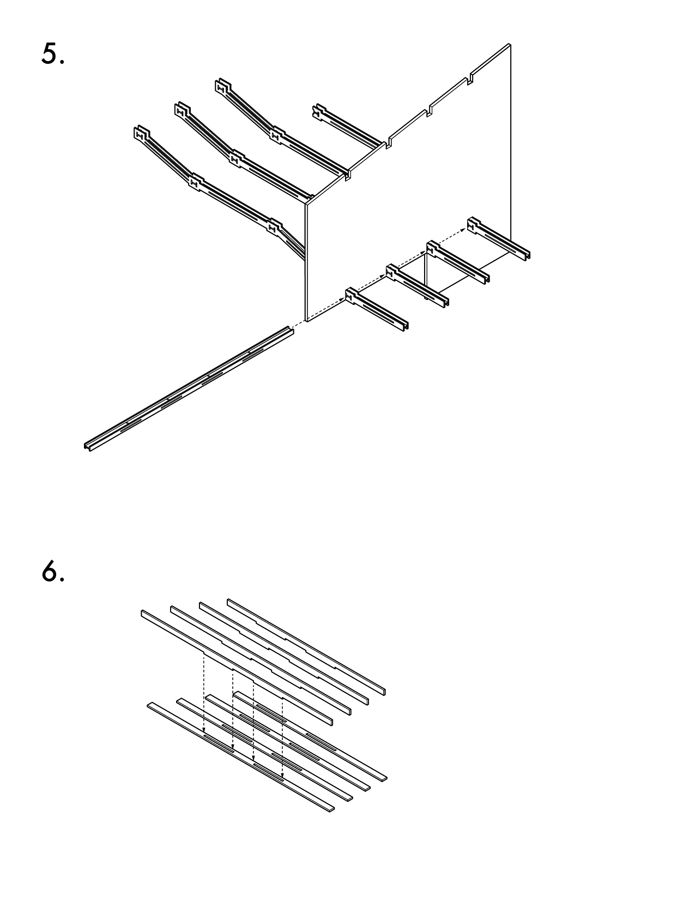

    

    
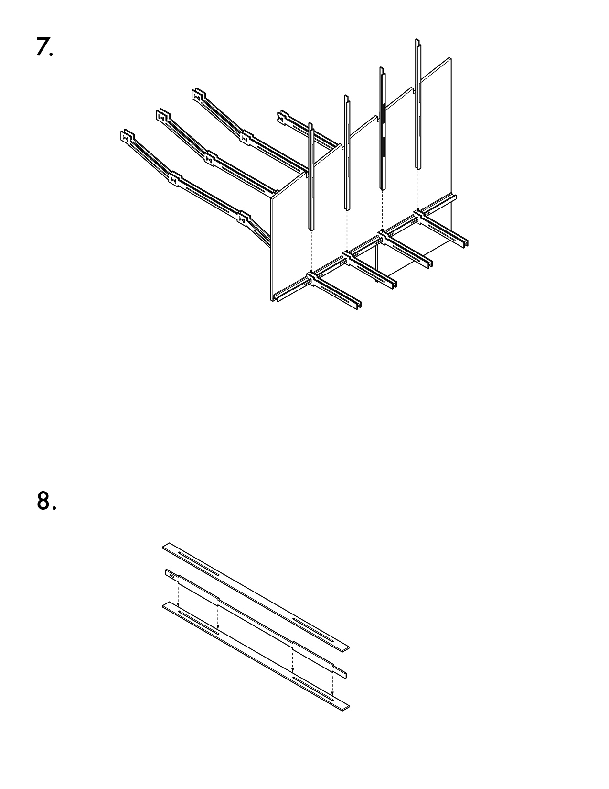

    
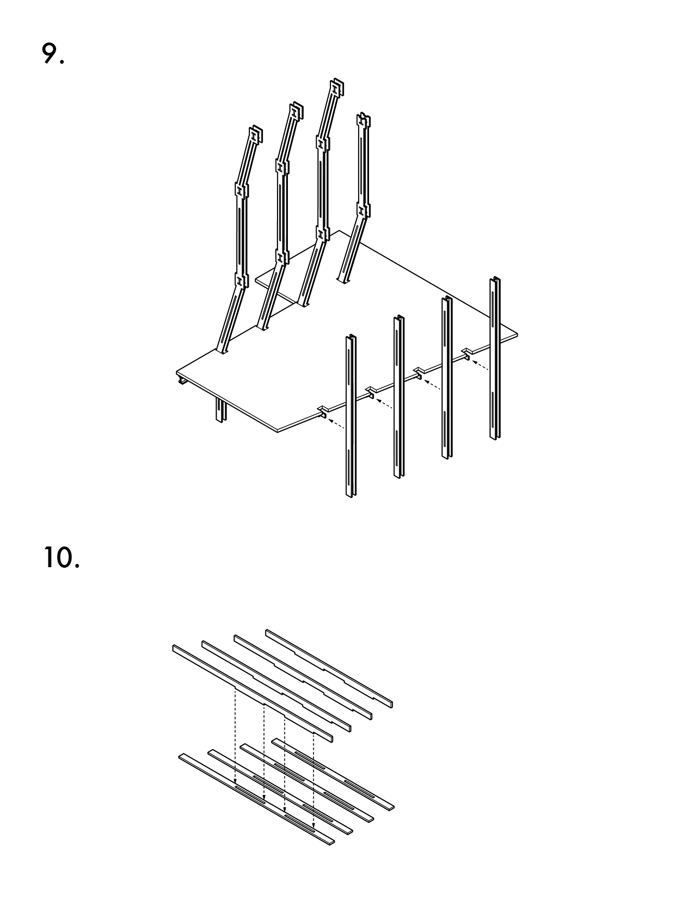

    

    
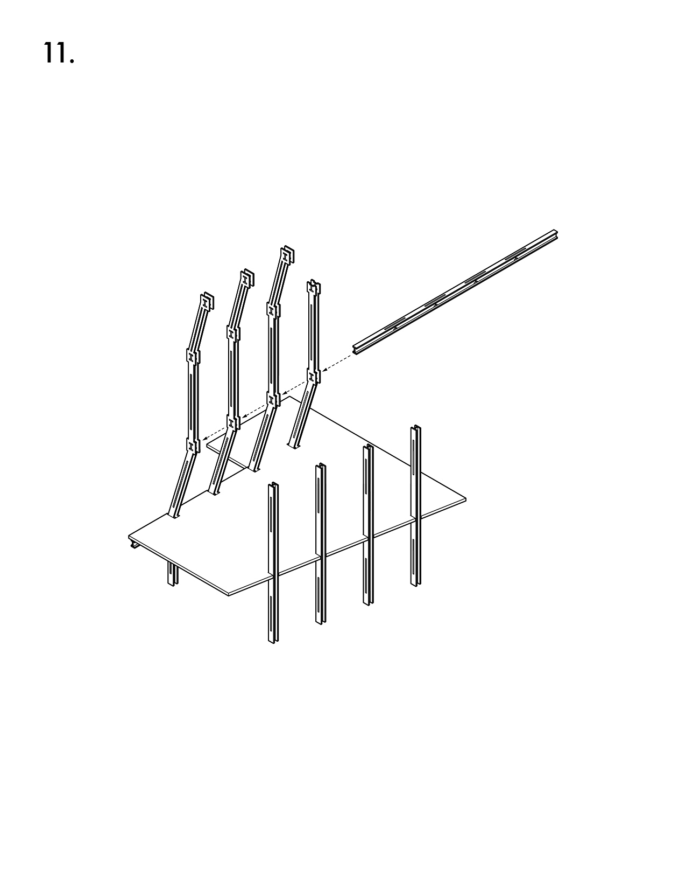

    
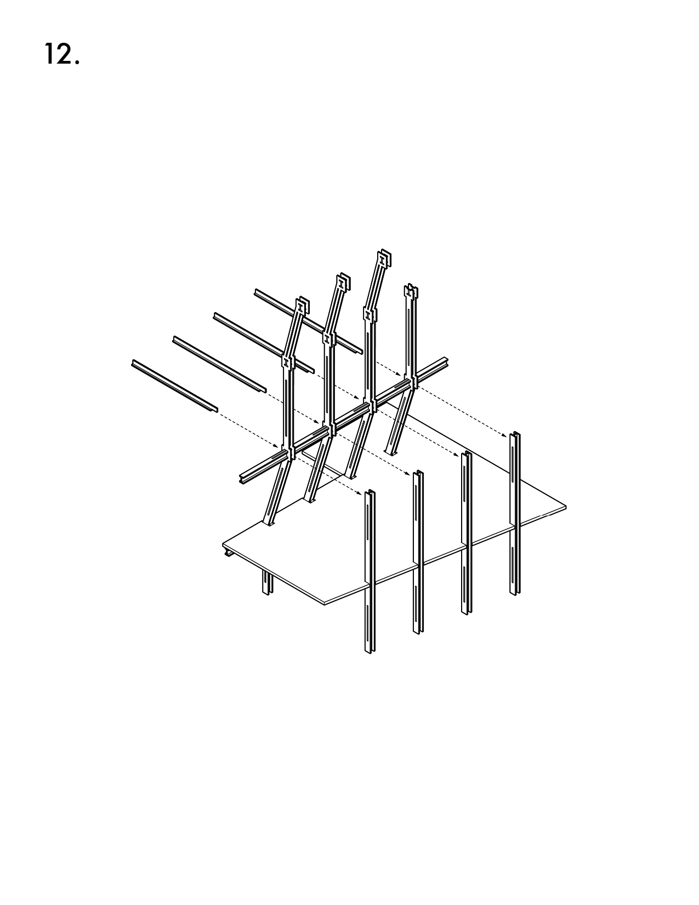

    

    
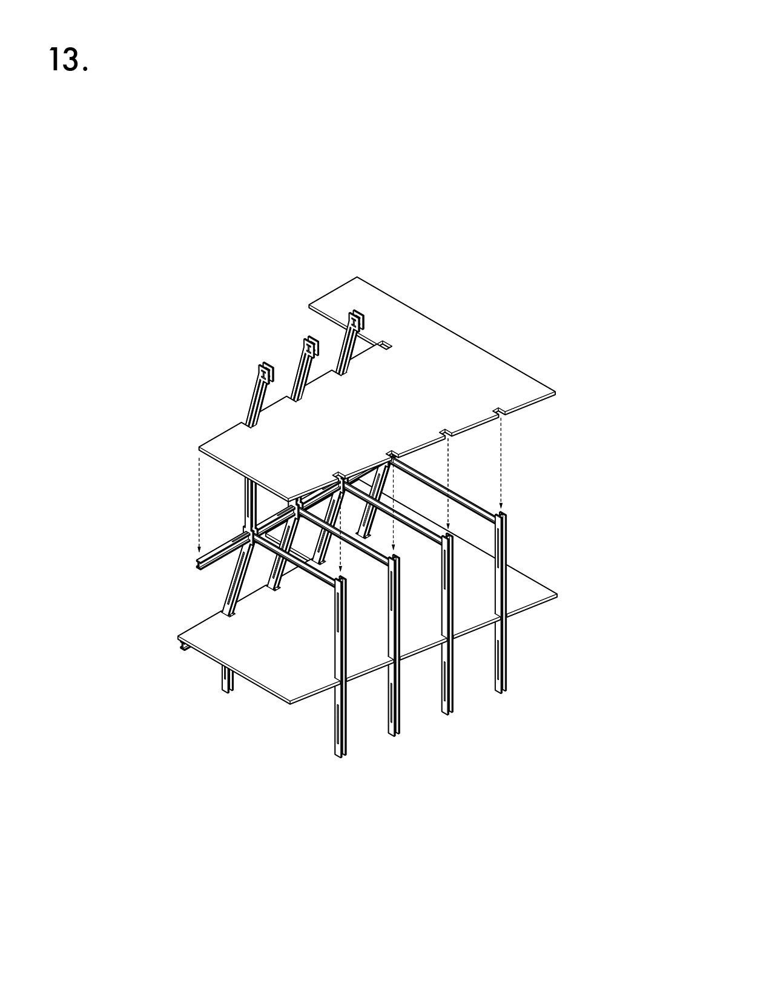

    
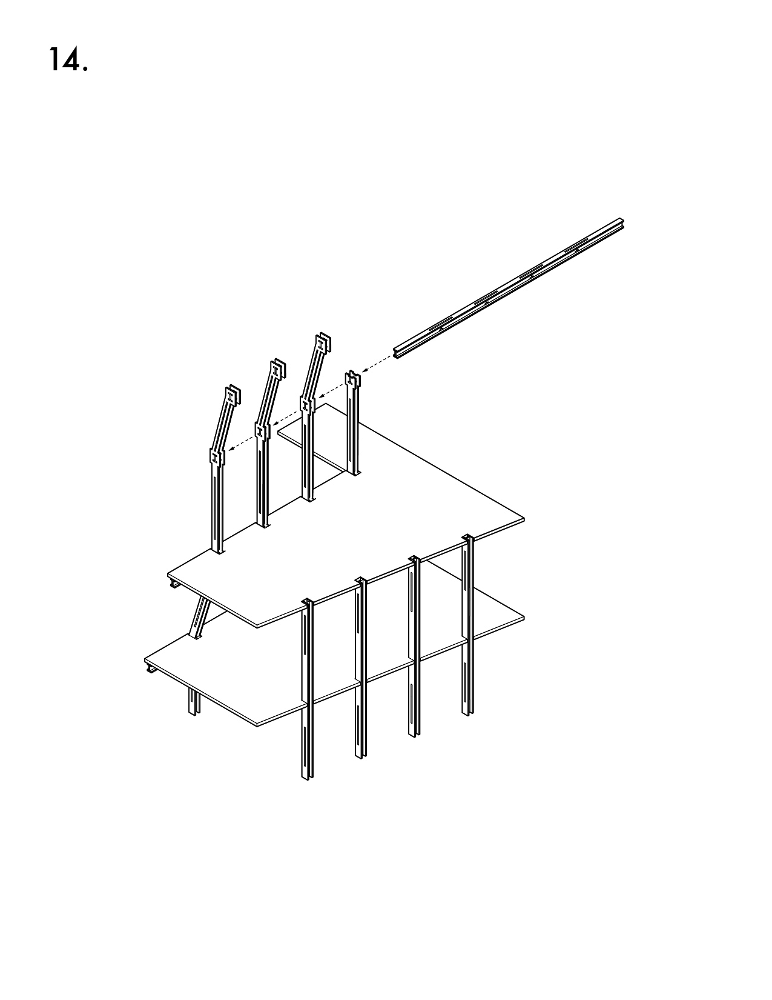

