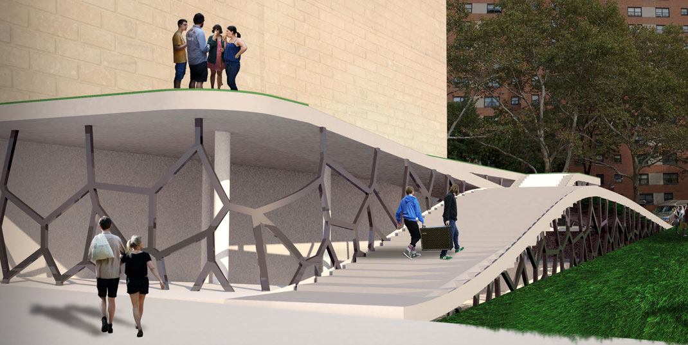
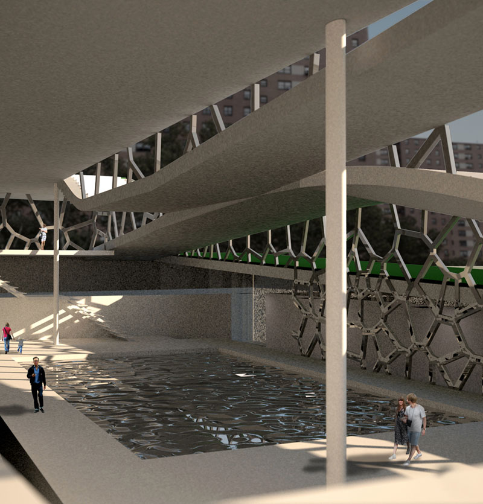
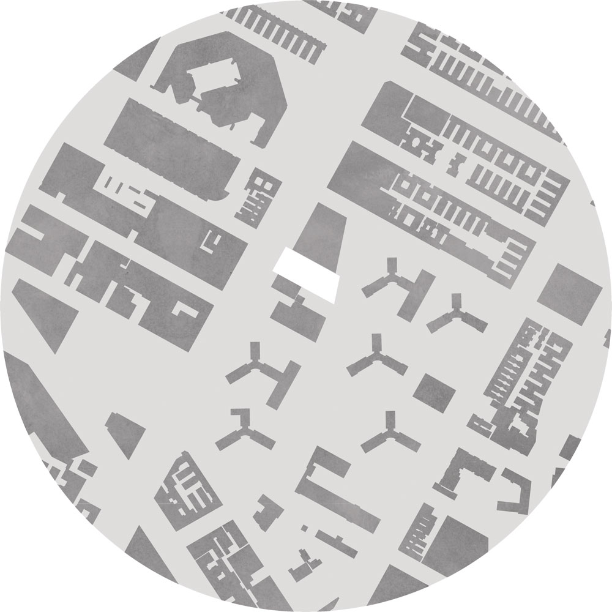
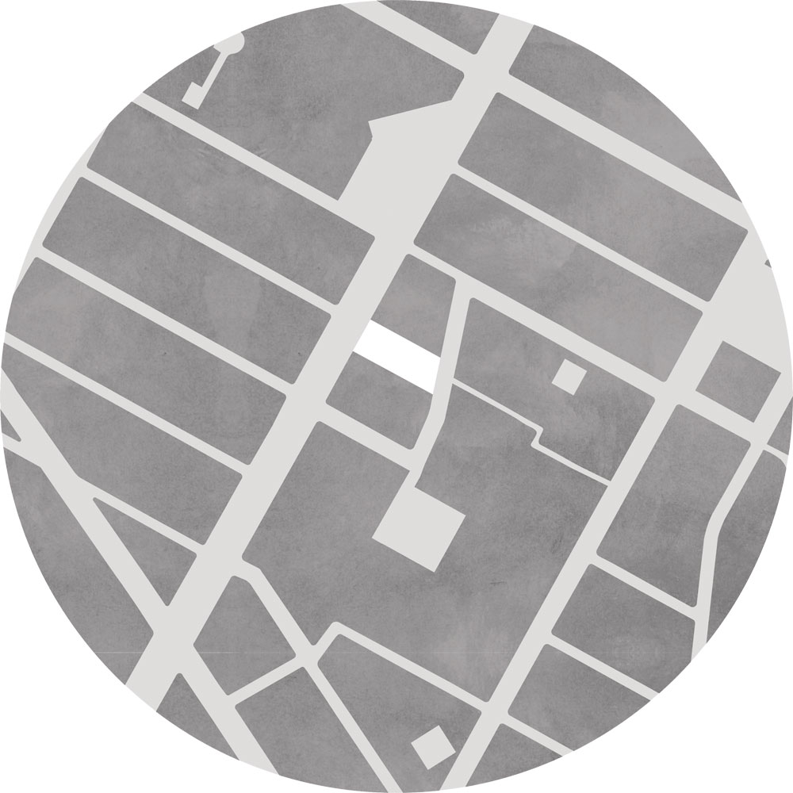
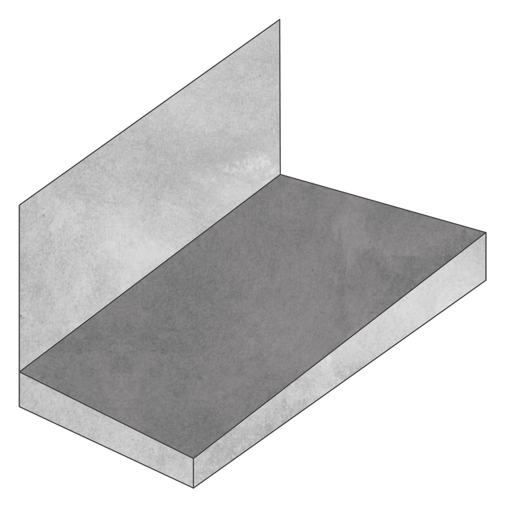
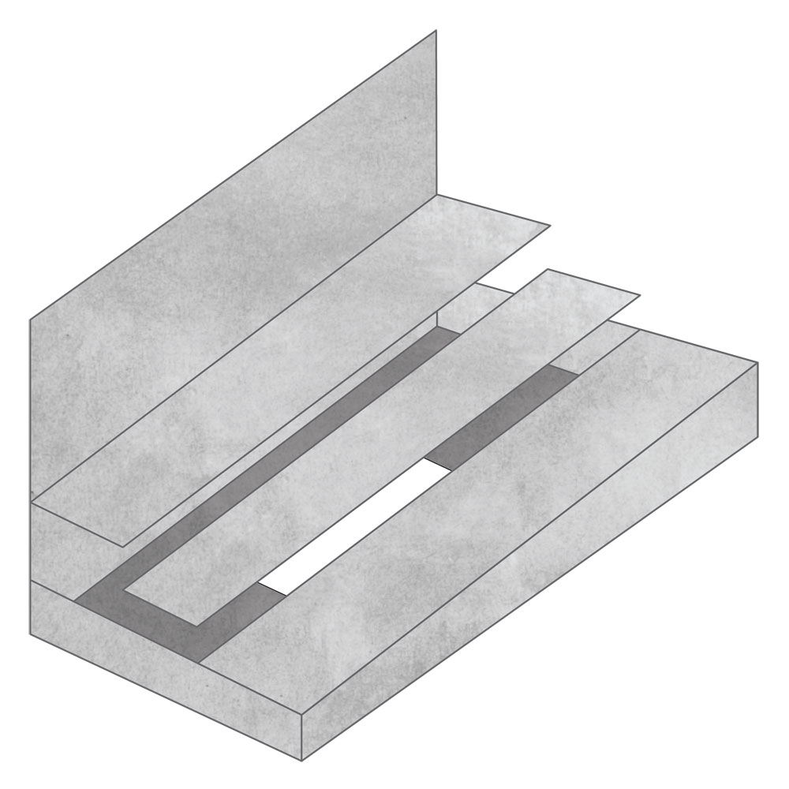
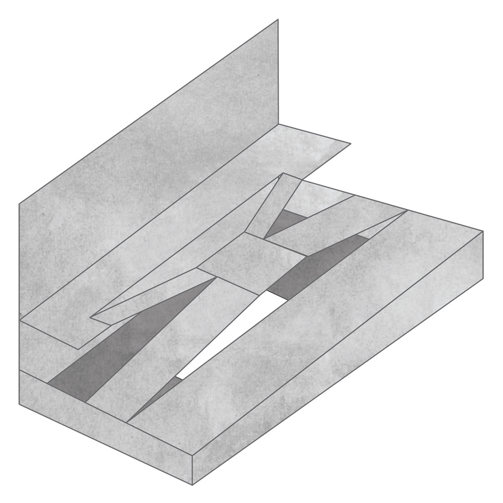
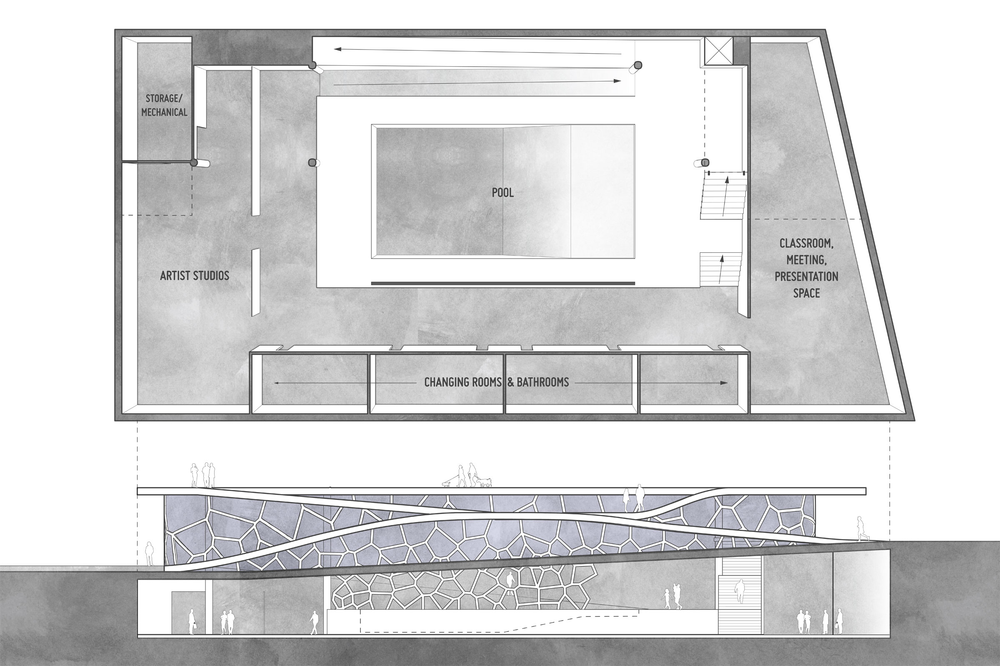
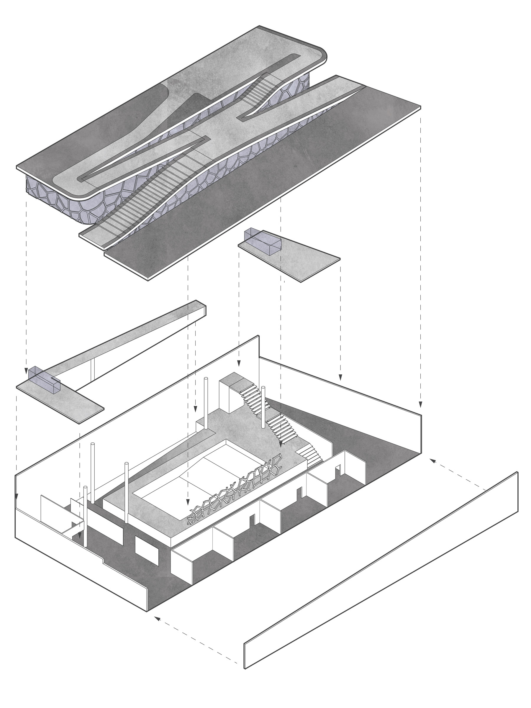
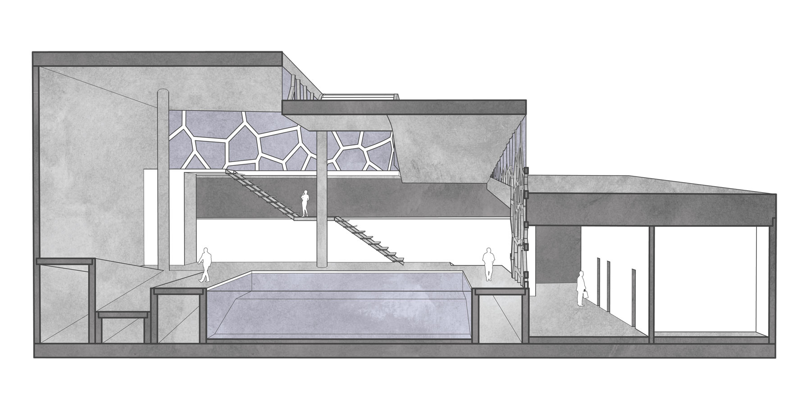

title: Manhattanville Pool & Community Center
---

    

    

    

    

        
Sandwiched between the Manhattanville Housing Projects and an expansion of Columbia University's campus, this project aims to preserve and enhance the entire site surface as usable, public space, with interior spaces that take advantage of the unique formal characteristics that arise as a result of the urban strategy.

    

    

    

Neighborhood: Open Space (light gray)

    

    

Neighborhood: Public &amp; Usable Space (light gray)

    

    

    

        
As of late 2014, the site was a parking lot. With four formal moves, we can reclaim this space for the neighborhood and Columbia communities:

    

    
<small class="aligncenter caps">1. Retain site</small>

    
<small class="aligncenter caps">2. Place entire building program below grade</small>

    
<small class="aligncenter caps">3. Raise platforms above program to provide access and views</small>

    
<small class="aligncenter caps">4. Connect platforms with wide circulation paths and stairs</small>

    

    

    

Roof, mezzanine, and at-grade circulation path may be used for neighborhood gatherings, farmers’ markets, and family reunions.

    

    

    

At pool level, the facade glass pattern acts as a screen, separating the changing area while allowing natural light to enter.

