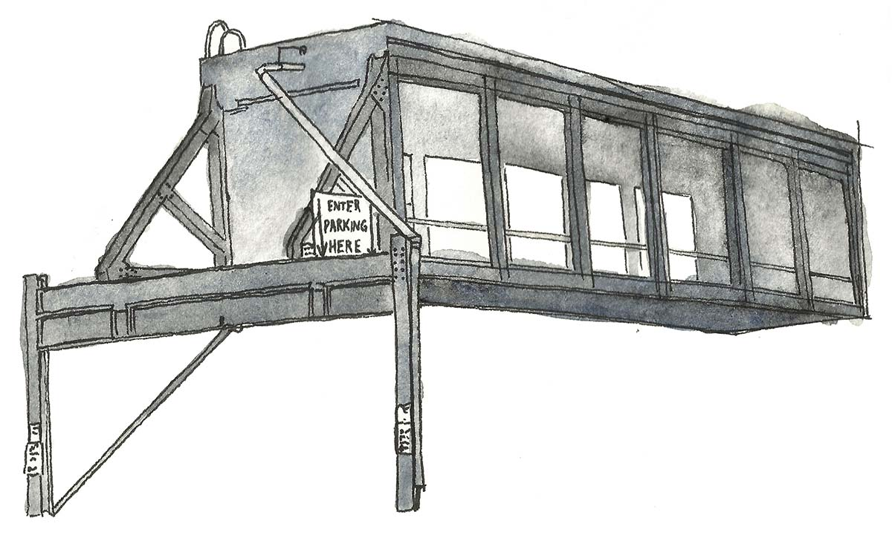
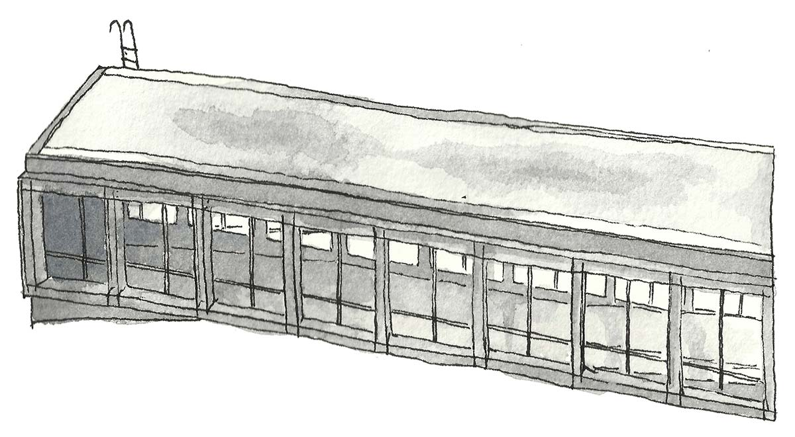
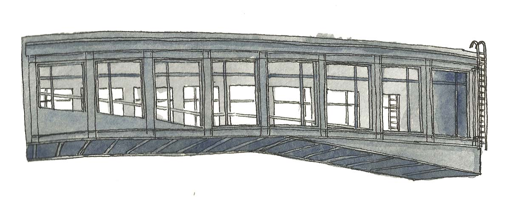
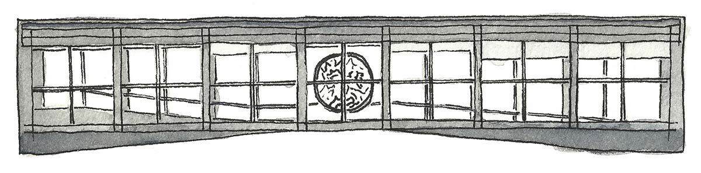
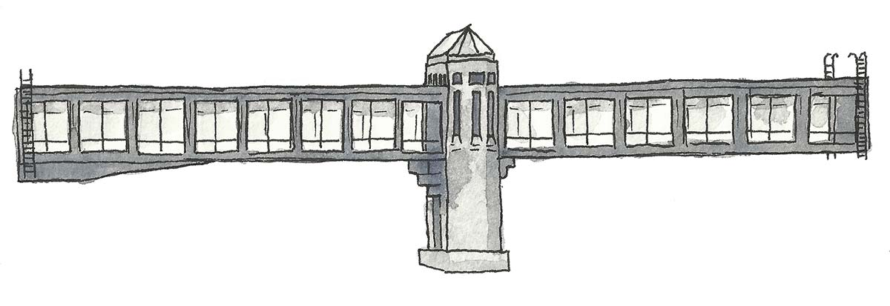
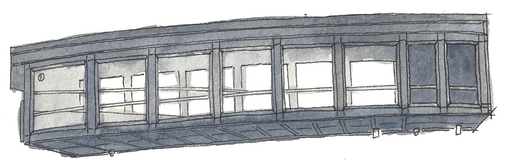
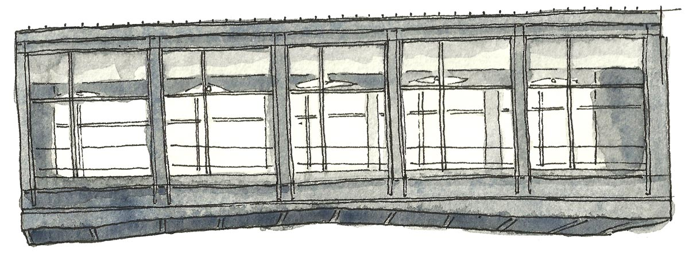

title: St. Paul Skyways
---

    

    

        
Encompassing several miles, the St. Paul Skyways function primarily as interstitial spaces for pedestrians navigating downtown.

By divorcing Skyways from their context (and thus their function as connectors) and presenting them as singular objects, I bring attention to their design and aesthetics, as well as to the formal diversity across structures.

    

    

        
    

    

    

        

            
        

        

            
        

    

    

    

        
    

    

    

    

    

    

    

