title: Public Toilet in Straus Park
---

    

        
Straus Park is a small, triangle-shaped plot on Broadway in the Upper West Side of Manhattan. This proposal for a public toilet replaces a small set of stairs, creating an accessible space with a waiting area.

        
Situated at the intersection of Broadway and West End Avenue, pedestrians walking north on the west side of Broadway <em>must</em> pass through Straus Park. The toilet's site takes advantage of this pattern.

        

            
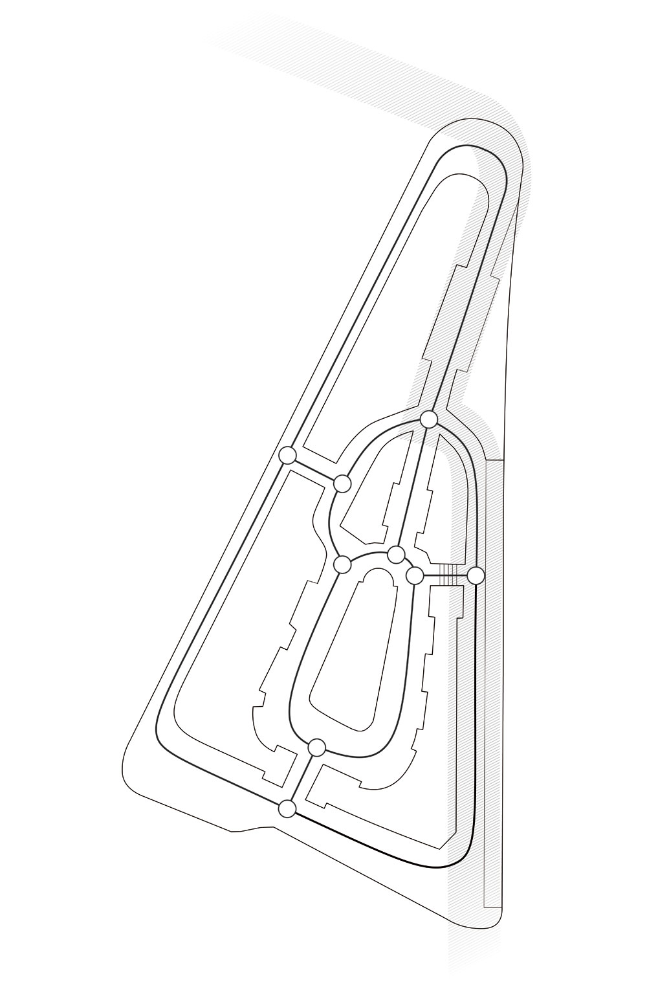

            
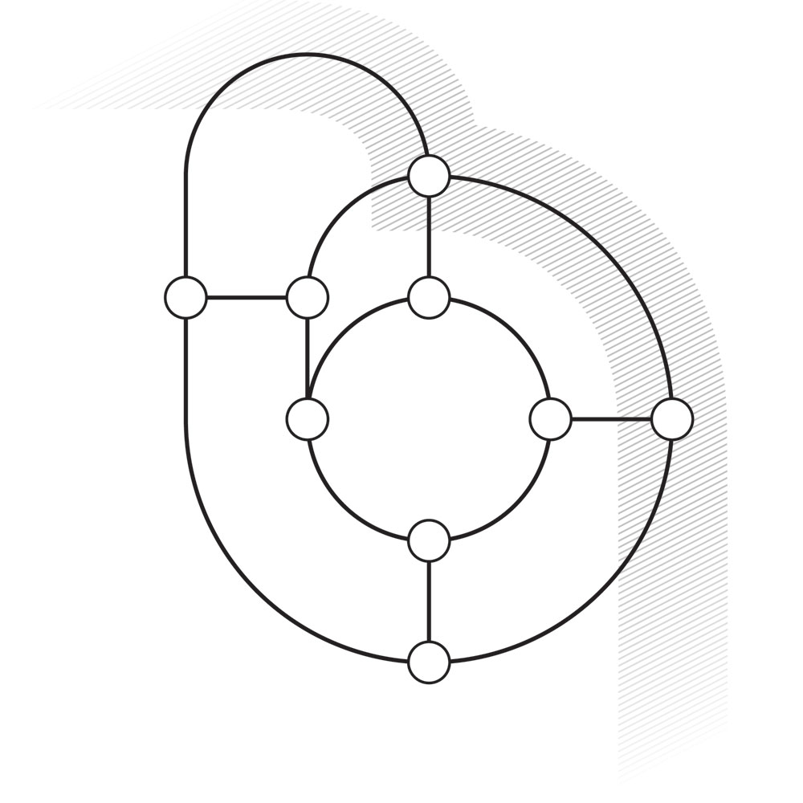
Before: Path adjacent to park

            
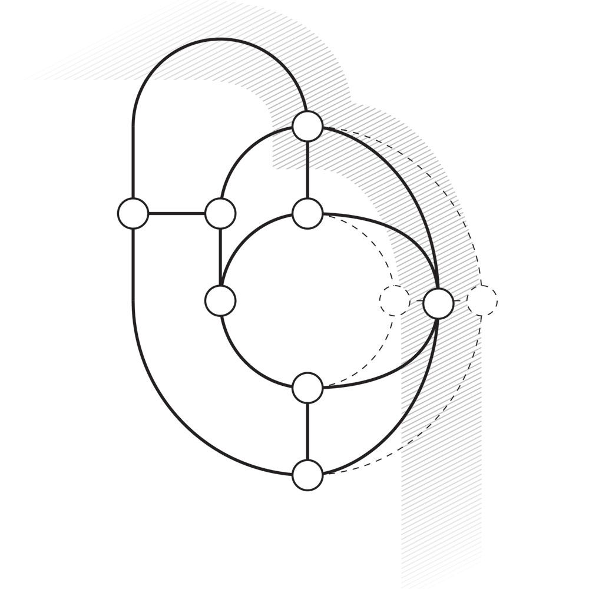
After: Path drawn closer to park

        

    

    
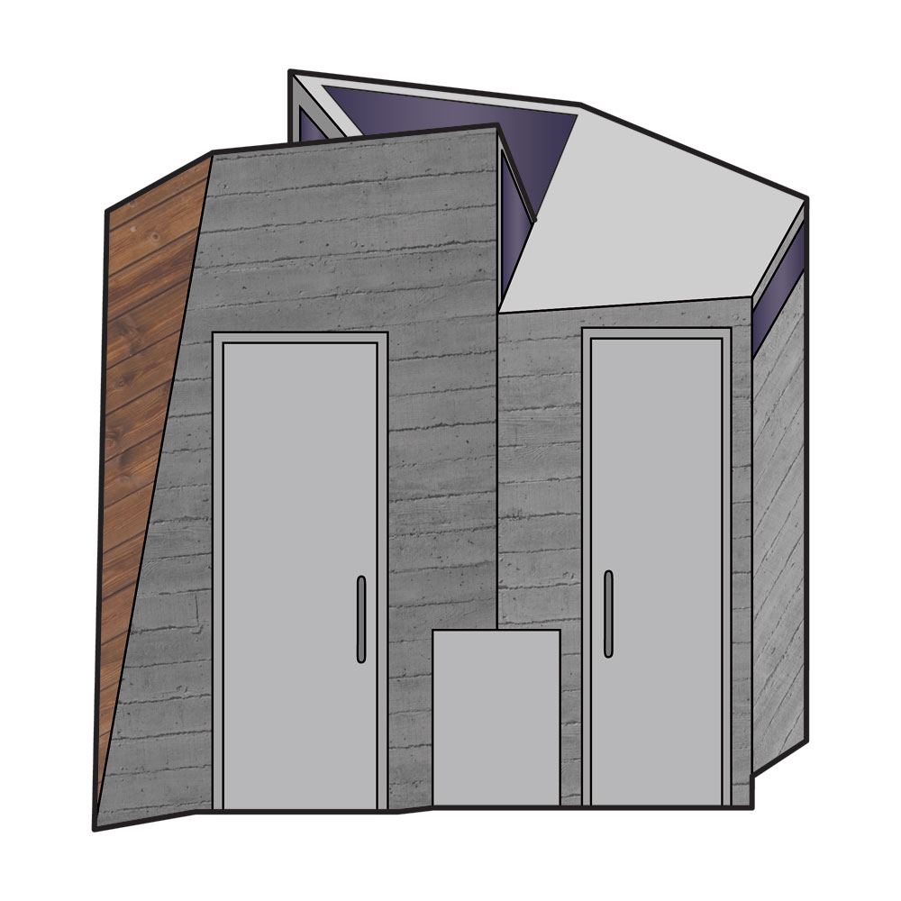

    

    

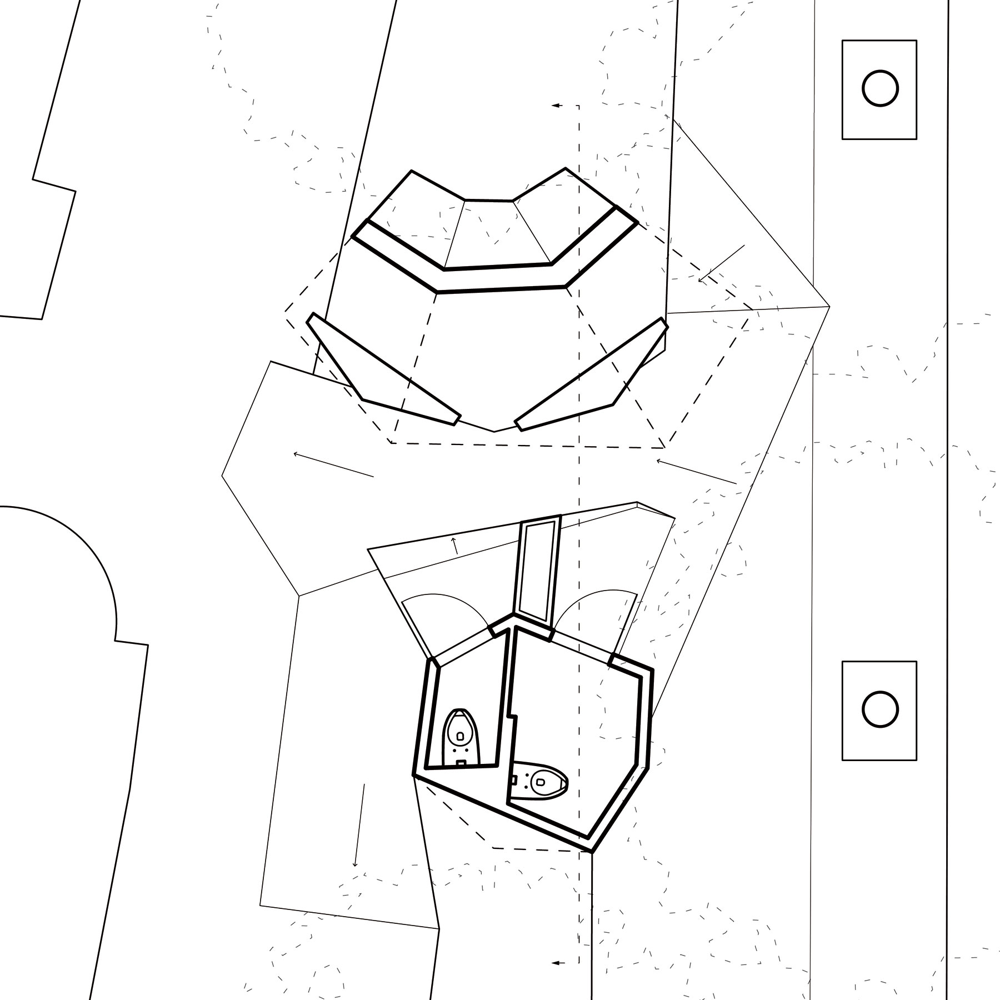

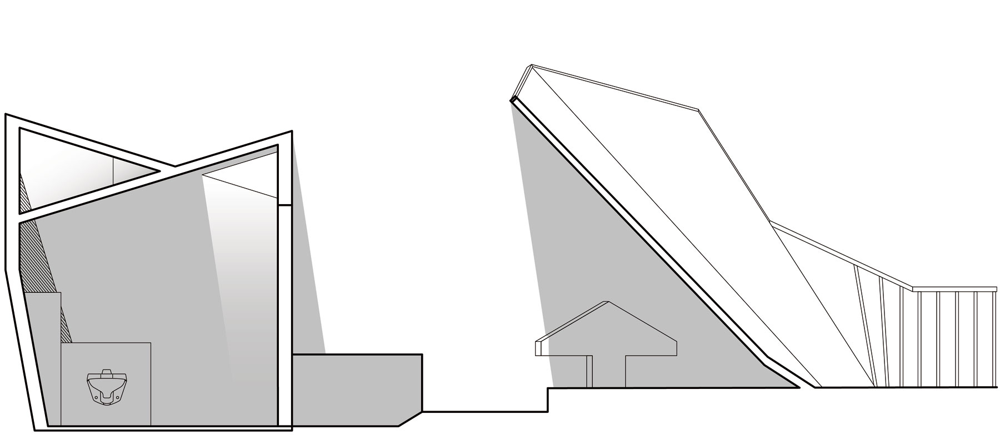

    
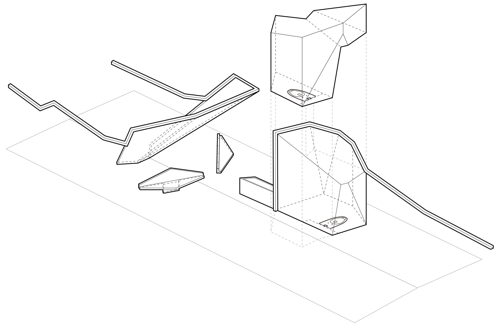
Large, concrete canopy and benches provide a sheltered waiting area

    
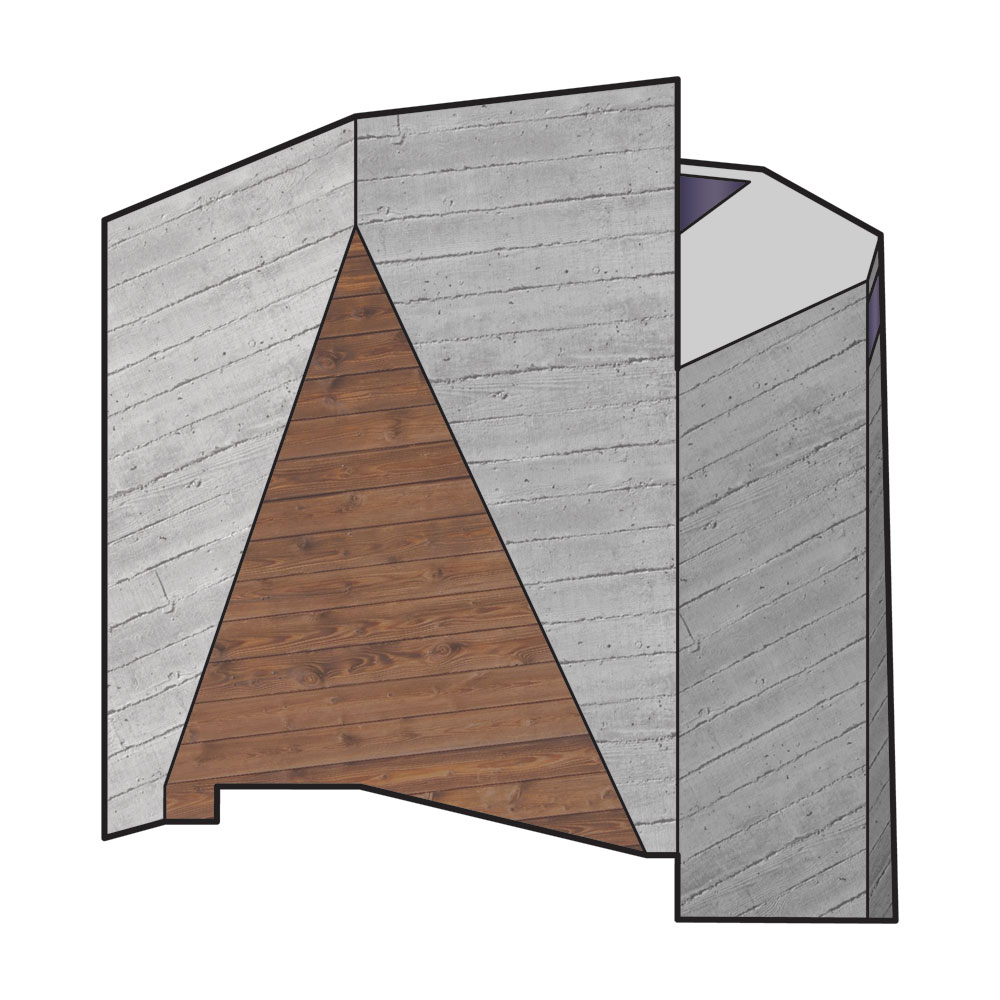

    
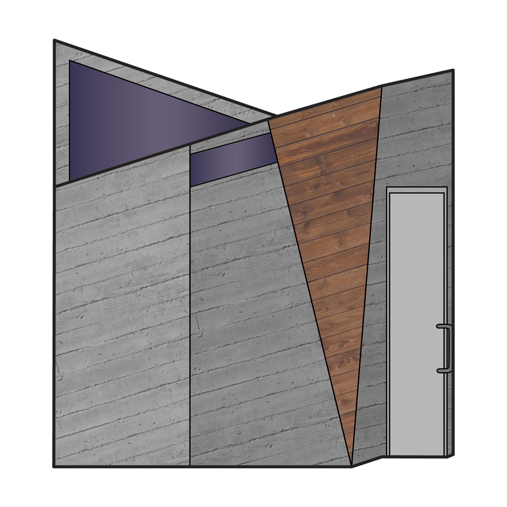

    

    
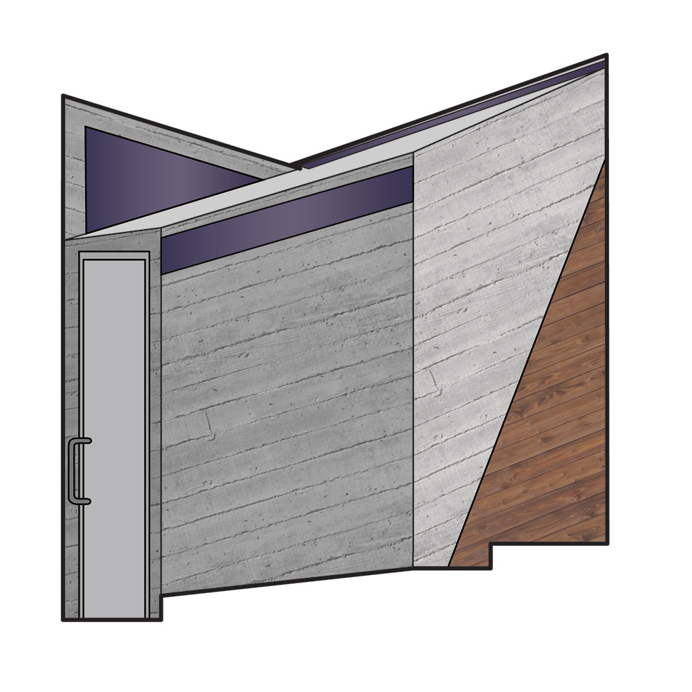

    

    
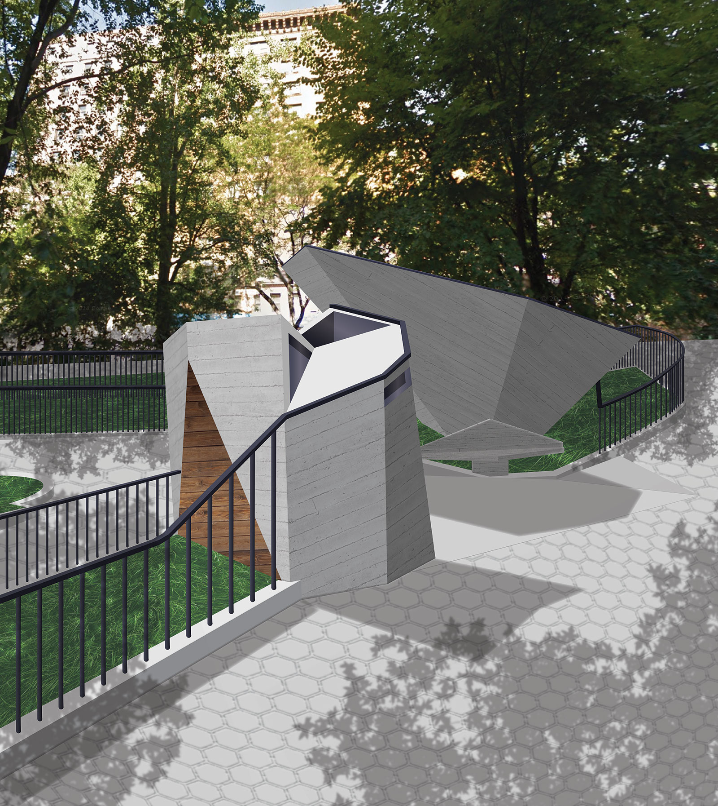

